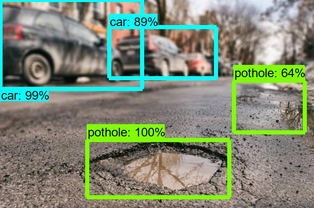

# Pothole Detection Using YOLO

## Features
- Streamlit Webapp
- MongoDB Database
- Video and Image Processing
- Live Streamlit Camera Feed

## How to setup ?

DO: `pip install -r requirements.txt`

RUN: `streamlit run webapp.py`